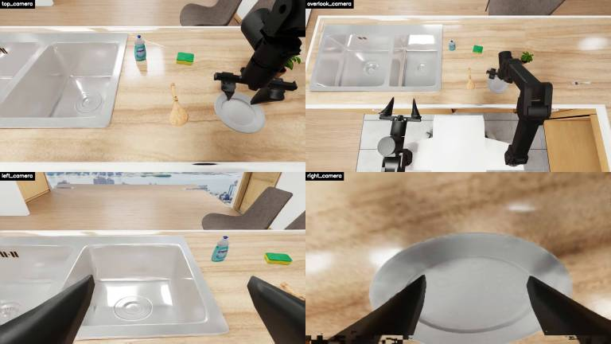

# VLM Rollout Evaluation

This repo evaluates whether VLMs can score robot policy rollouts from visual evidence and match simulator-computed task metrics.

## Evaluation Setup

- Input: each rollout video is downsampled to up to 50 synchronized frames.
- Frame format: each sampled frame is a 2x2 composite of four camera views.
- Prompt: a unified scoring prompt describes the task metric and asks the model to output JSON with `score`, `success`, and `reason`.
- Score rule: `score` follows the task-specific metric; `success = 1` iff `score == 1.0`.
- Dataset: 6 tasks, 60 rollouts per task, 360 episodes total from `cosmos_test_50k`, `ebench-test_step_h30`, and `lingbot_57500_1`.
- Simulator reference: average sim score is `0.315`; sim success rate is `0.214`.

Sample four-camera composite:

## Metrics

- `pearson` / `spearman`: correlation between simulator score and VLM score.
- `MAE` / `RMSE`: absolute and squared score error against simulator score; lower is better.
- `SR acc`, `precision`, `recall`, `F1`: binary success-rate metrics comparing VLM success to simulator success.
- `TP/TN/FP/FN`: confusion matrix for binary success.
- `avg VLM score`: average continuous score predicted by the model.
- `avg VLM SR`: average success rate predicted by the model.

## Results

Only models with full `360/360` coverage are included in the main table.

| model | scored/total | pearson | spearman | MAE | RMSE | SR acc | precision | recall | F1 | TP/TN/FP/FN | avg VLM score | avg VLM SR |
|---|---:|---:|---:|---:|---:|---:|---:|---:|---:|---|---:|---:|
| bailian/deepseek-v4-pro | 360/360 | 0.000 | -0.012 | 0.391 | 0.580 | 0.683 | 0.247 | 0.234 | 0.240 | 18/228/55/59 | 0.217 | 0.203 |
| doubao-seed-2-0-pro-260215 | 360/360 | 0.927 | 0.918 | 0.045 | 0.155 | 0.969 | 0.923 | 0.935 | 0.929 | 72/277/6/5 | 0.313 | 0.217 |
| gemini-3.5-flash | 360/360 | 0.723 | 0.717 | 0.135 | 0.313 | 0.892 | 0.707 | 0.844 | 0.769 | 65/256/27/12 | 0.374 | 0.256 |
| gpt-5 | 360/360 | 0.726 | 0.685 | 0.128 | 0.300 | 0.911 | 1.000 | 0.584 | 0.738 | 45/283/0/32 | 0.220 | 0.125 |
| gpt-5.5 | 360/360 | 0.817 | 0.819 | 0.083 | 0.241 | 0.933 | 0.896 | 0.779 | 0.833 | 60/276/7/17 | 0.300 | 0.186 |
| kimi-k2.6 | 360/360 | 0.745 | 0.734 | 0.136 | 0.312 | 0.886 | 0.673 | 0.909 | 0.773 | 70/249/34/7 | 0.403 | 0.289 |
| qwen3.6-plus | 360/360 | 0.835 | 0.830 | 0.088 | 0.242 | 0.942 | 0.818 | 0.935 | 0.873 | 72/267/16/5 | 0.363 | 0.244 |

Current best overall model is `doubao-seed-2-0-pro-260215`: it has the highest score correlation, lowest MAE/RMSE, and best binary success F1 on the 360-rollout benchmark.

Partial runs not included in the main comparison: `qwen-max` and `or/qwen3.5-9b` currently have 10 scored episodes each.
